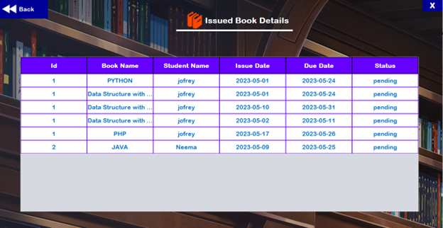
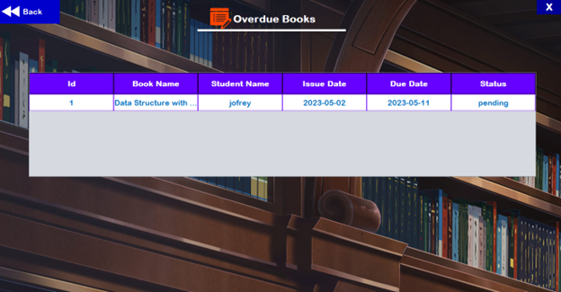
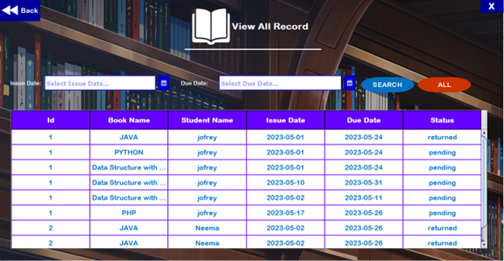
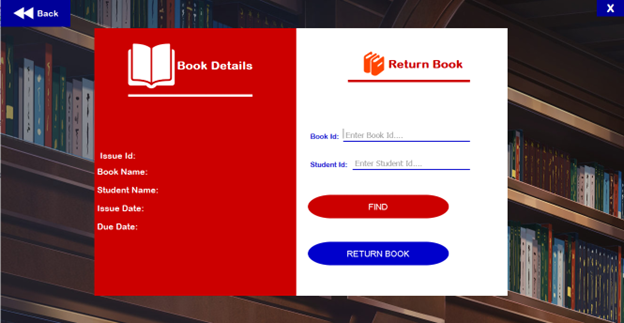
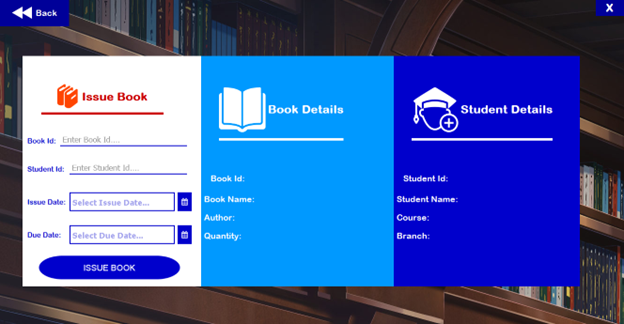
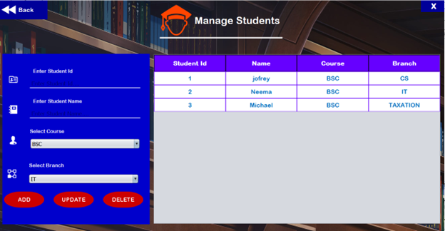
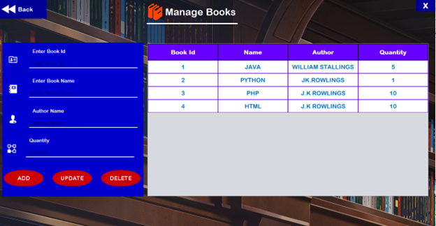
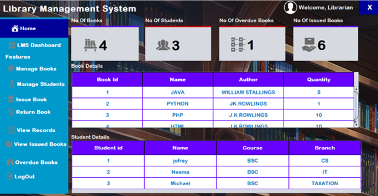

# Library Management System (Work in Progress)

## Project Overview

The **Library Management System (LMS)** is a Java-based software designed to automate and simplify essential library tasks, such as cataloging books, managing user accounts, and tracking the borrowing and returning of books. By digitizing these operations, the LMS aims to increase efficiency, minimize errors, and provide a seamless experience for both librarians and users.

**Note**: This project is currently a **work in progress**, with more features and improvements being actively developed.

## Team Members

- **Saksham Goswami** - Roll No: 23SCSE1280008
- **Rajneesh Patel** - Roll No: 23SCSE1280003
- **Utkarsh Srivastava** - Roll No: 23SCSE1280042
- **Aditya Kumar** - Roll No: 23SCSE1280055

## Objectives

The Library Management System aims to:
- Automate library operations like book cataloging, issuing/returning, and managing user accounts.
- Improve accuracy by reducing the need for manual record-keeping.
- Provide a user-friendly interface that enhances the overall user experience.
- Enable real-time tracking of books and user activities.

## Problem Statement

Libraries that rely on manual systems face challenges such as:
- Inefficient tracking of book availability and user activity.
- Inaccurate record-keeping, leading to lost or overdue books.
  
This system addresses these challenges by providing an automated solution that ensures smooth library management.

## Technical Stack

- **Programming Language**: Java
- **Database**: MySQL (or any relational database)
- **Development Environment**: IntelliJ IDEA
- **Frameworks**: 
  - HTML/CSS 
  - JavaScript
- **Libraries**: JDBC (Java Database Connectivity) for interacting with the database

## Features (Current and Planned)

### Completed Features:
- **Database Connection Management:** Establishes a connection to the MySQL database, and safely closes it after use.
- **Adding a Book:** Allows for adding new books with details such as title, author, ISBN, quantity, and available quantity.
- **Retrieving a Book by ID:** Retrieves book details using a unique book ID.
- **Retrieving All Books:** Lists all books in the database, displaying details for each one.
- **Member Representation:** Creates a model for library members with properties like name, email, membership date, and status.

### Upcoming Features:
- **Enhanced UI**: Improving the design using HTML.

## Screenshots

Here are some screenshots of the Library Management System:

